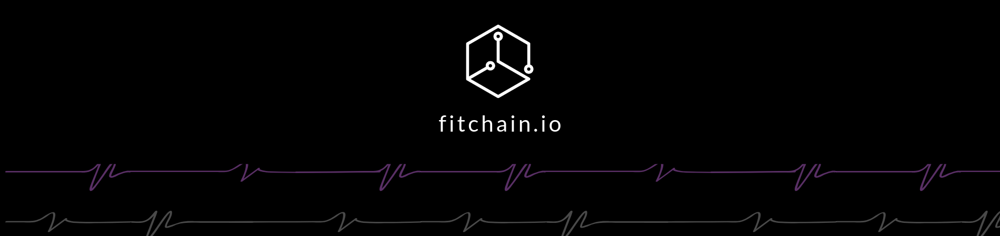

[](https://fitchain.io)
# Fitchain contracts


Fitchain [contracts](docs/ContractsStructure.md) implements the following modules:
- Gossipers channel for proof of training
- Verifiers pool for verification game 
- Commit-Reveal scheme for secure voting
- Actors registry such as verifiers, gossipers, data owners
- Model Registry that manages the model life cycle

## Getting Started

For local deployment, follow the below steps in order to setup fitchain contracts in your machine

- In a new terminal, install required packages then start testrpc (or ganache-cli)

```
  $ npm install
  $ npm install -g ganache-cli 
  $ ganache-cli 
```


- Skip this step, if you are running local testnet. Configure `truffle.js` by adding the network Id, host IP address, and port number.


```javascript
module.exports = {
	networks: {
        development: {
            host: 'localhost',
            port: 8545,
            network_id: '*',
            gas: 6000000
        }
	},
	compilers: {
        solc: {
            version: '0.4.25'
        }
	},
	solc:{
        optimizer: {
            enabled: true,
            runs: 200
        }
    }
};
```

- Compile solidity contracts as follows

```
  $ npm run compile
```

- Finally, migrate  and test fitchain contracts

```
  $ npm run migrate 
  $ npm run test
```


## Documentation

- [Architecture documentation](docs/ContractsStructure.md)
- [APIs documentation - WIP](docs/api.md)

## Contributing

For any new issue, feature, or update, create a pull request and we will add it there.See also the list 
of [contributors](CONTRIBUTORS.md) who participated in this project. 

## License

This project is licensed under the GPL License - see the [LICENSE.md](LICENSE.md) file for details
