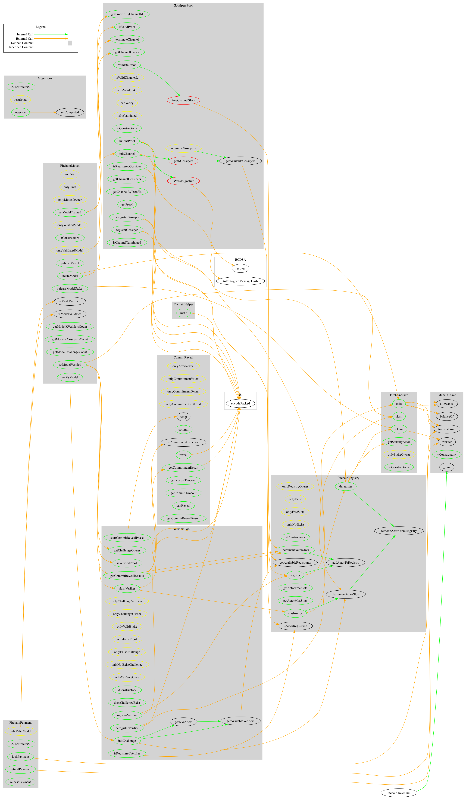

# Fitchain Contract's Structure

The below figure shows more information about the [fitchain] contracts' structure. It is auto-generated image using [consensys/surya](https://github.com/ConsenSys/surya).

### List of contracts:
- Token contract (ERC20 based)
- Staking contract
- Registry contract
- Gossipers pool contract
- Verifiers pool contract
- Commit-Reveal scheme contract
- Payment contract
- Model contract

